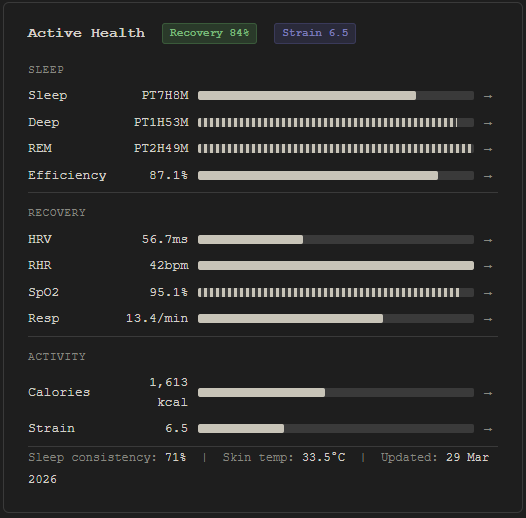

# whoop-obsidian

Automatically sync your daily Whoop health data into an Obsidian note — rendered as a dark-themed health card with live bar metrics and 7-day rolling trend arrows.



## What it does

Runs each morning via a scheduled task, pulls yesterday's Whoop data via the official API, and overwrites a single Obsidian note (`06 Health/Active Health.md`) with:

- YAML frontmatter containing all health metrics
- An embedded DataviewJS card that renders the visual dashboard

Metrics tracked: Recovery score, HRV, RHR, SpO2, skin temp, sleep duration, deep sleep, REM, sleep efficiency, sleep consistency, respiratory rate, strain, and calories.

Trend arrows (↑ ↓ →) are computed automatically by comparing today's values against a 7-day rolling average stored in lightweight YAML snapshots. Trends become meaningful after 3 days, and fully calibrated after 7.

---

## Requirements

- Python 3.10+
- A Whoop membership + device
- Obsidian with the [Dataview](https://github.com/blacksmithgu/obsidian-dataview) community plugin

---

## Setup

### 1. Clone and install dependencies

```bash
git clone https://github.com/yourusername/whoop-obsidian.git
cd whoop-obsidian
pip install requests python-dateutil pyyaml python-dotenv
```

### 2. Configure environment

```bash
cp .env.example .env
```

Open `.env` and fill in:

```
OBSIDIAN_VAULT=/absolute/path/to/your/vault
WHOOP_CLIENT_ID=your_client_id
WHOOP_CLIENT_SECRET=your_client_secret
```

### 3. Register a Whoop developer app

1. Go to [developer-dashboard.whoop.com](https://developer-dashboard.whoop.com) and sign in
2. Create a Team if prompted, then click **Create App**
3. Set the Redirect URI to exactly: `http://localhost:8765/callback`
4. Enable scopes: `read:recovery`, `read:sleep`, `read:cycles`
5. Copy the Client ID and Secret into your `.env`

No app approval is required for personal use.

### 4. Authenticate

```bash
python whoop_to_obsidian.py --auth
```

This opens your browser to the Whoop authorisation page. After approving, your browser will redirect to a localhost URL that won't load — that's expected. Copy the full URL from the address bar and paste it back into the terminal. Your token is saved to `~/.whoop_token.json` and auto-refreshes from then on.

### 5. Install the CSS snippet

1. In Obsidian: **Settings → Appearance → CSS Snippets → open snippets folder**
2. Copy `whoop-health.css` into that folder
3. Back in Obsidian, click the refresh icon and toggle `whoop-health` on

### 6. Enable DataviewJS

1. In Obsidian: **Settings → Community Plugins → Dataview → settings**
2. Toggle on **Enable JavaScript Queries**

### 7. Test

```bash
# Dry run — prints output without writing to vault
python whoop_to_obsidian.py --dry-run

# Live run
python whoop_to_obsidian.py
```

Open `06 Health/Active Health` in Obsidian — you should see the rendered card.

---

## Scheduling

### macOS / Linux (cron)

```bash
crontab -e
# Add this line — runs at 8am daily:
0 8 * * * /path/to/venv/bin/python /path/to/whoop_to_obsidian.py >> ~/whoop_sync.log 2>&1
```

### Windows (Task Scheduler)

1. Open **Task Scheduler** → **Create Basic Task**
2. Name: `Whoop Sync` → Trigger: **Daily** at **8:00 AM**
3. Action: **Start a program**
   - Program: `python`
   - Arguments: `C:\path\to\whoop_to_obsidian.py`
   - Start in: `C:\path\to\`

---

## Vault structure

The script creates and manages two things in your vault:

```
06 Health/
├── Active Health.md       ← the live note, overwritten daily
└── history/
    ├── 2026-03-28.yaml    ← daily snapshots for trend computation
    ├── 2026-03-29.yaml
    └── ...
```

The `history/` folder is written automatically — no setup needed.

---

## Customising baselines

Bar widths are calculated as `(value / max) * 100%`. The defaults are conservative — tune the `BASELINES` dict in the script to your own ceiling values after a week or two of data:

```python
BASELINES = {
    "hrv_max":       150,   # ms — your strong HRV ceiling
    "sleep_hrs_max": 9.0,
    "deep_mins_max": 120,
    "rem_mins_max":  120,
    "calories_max":  3500,
    ...
}
```

---

## Note location

By default the health note is written to `06 Health/Active Health.md`. To change this, set `HEALTH_NOTE` in your `.env`:

```
HEALTH_NOTE=Dashboard/Health.md
```

---

## Troubleshooting

**"No scored data found for yesterday"** — Whoop may still be processing. Try again 30 minutes after waking. If it persists, check your device has synced in the Whoop app.

**404 on `/v2/sleep`** — The script routes sleep via the cycle endpoint by default, so this shouldn't block you. If you see it, confirm `read:cycles` is enabled in your Whoop app.

**Trends all showing flat** — Expected for the first 3 days. The script needs a minimum of 3 historical snapshots before it starts computing directional trends.

**Token expired errors** — Delete `~/.whoop_token.json` and re-run `--auth`.

---

## Contributing

PRs welcome. Obvious extensions:
- Support for other vault structures / note paths
- Weekly trend summary note
- Garmin / Apple Health / Oura adapters following the same pattern

---

## License

MIT
